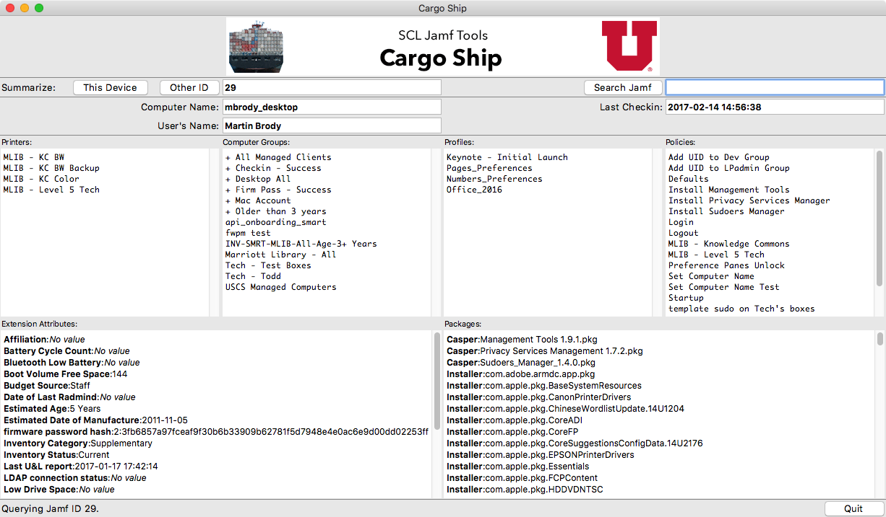

# SCL Jamf Tools

This repository contains a collection of tools written to perform as enhancements to the Jamf Pro management software. You can read about them at our [blog post](https://apple.lib.utah.edu/?p=2057) or in the indiviual project areas.

Our goal is to make genericized versions of our internal tools available to other Jamf administrators. They are usable as is, but are intended as frameworks that others can use to build custom tools to more closely fit their environments.

## Download

[Download the latest package here!](../../releases/)

## Contents

- [Download](#download) - get the .dmg
- [Contact](#contact)
- [Cargo Ship](#cargoship)
- [Tugboat](#tugboat)
- [Update History](#update-history)

## Contact

If you have any comments, questions, or other input, either [file an issue](../../issues) or [send us an email](mailto:mlib-its-mac-github@lists.utah.edu). Thanks!

## [Cargo Ship](cargo_ship/README.md)

Cargo Ship is designed as a reflection tool, it shows you what should be on a specific client. It can read from Jamf Pro directly from ID's or by selecting from search results.

## [Tugboat](tugboat/README.md)

Tugboat is designed to make modifications to specific computer records on your Jamf Pro server.

## Update History

| Date       | Version | Notes                                    |
| ---------- | ------- | ---------------------------------------- |
| 2018.01.03 |         | Updated Tugboat 1.5.3 and Cargo Ship 1.0.3 |
| 2017.04.11 |         | Updated Tugboat 1.5.2 and Cargo Ship 1.0.1 |
| 2017.02.15 |         | Initial release.                         |