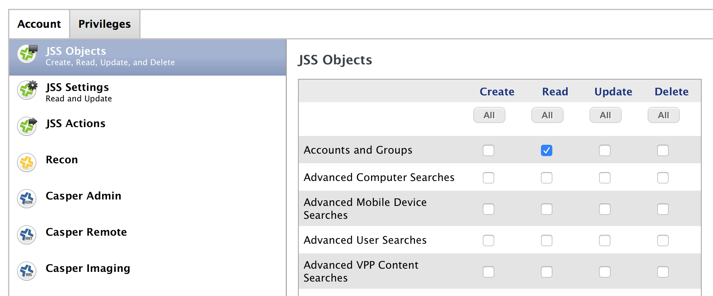

# Cargo Ship

Cargo Ship is designed as a kind of reflection tool, it shows you what Jamf thinks should be on a specific client. It can read from Jamf Pro directly from ID's or by selecting from search results.

This tool is identical to our inhouse version. However it can be customized to fit your environment by modifying it's Python code.

*Note: Offering a tool designed from the outset to be customized at the source level is a new venture for us. If you feel the documentation we've included is not sufficient to help you successfully navigate the source code, please consider raising an issue and we'll do our best to correct any short comings.*

2/16/17: Unfortunately it seems a lot of people are running into the LDAP bug I reference in the [blog post](https://apple.lib.utah.edu/?p=2057). If you are attempting to login as an LDAP user, Jamf does not map it's LDAP group permissions correctly. This is a known issue referred to as Product Issue PI-003395 inside Jamf. I urge you to contact your Jamf Technical Representative(s) and elevate this issue with them.

I've been getting some feedback from users in environments with 150+ policies that it can take on the order of 8 minutes from login to UI display due to the need to parse each policy individually in order to build the required data structures. I'm taking this feedback in consideration and am looking at ways to possibly postpone this step until requested by the user.

4/11/17: Released version 1.0.1 of Cargo Ship. Lots of tweaks, added logging with management_tools, much improved login.

[Jamf's release notes](http://docs.jamf.com/9.98/casper-suite/release-notes/Bug_Fixes_and_Enhancements.html) for version 9.98 say that PI-003395 has been corrected. We're unable to test this and we're eager to hear from others if this is the case.

1/3/18: Released version 1.0.3 of Cargo Ship. Improved LDAP logins, added multiprocessing to particularly resource-hungry area of code. Please be sure to enable LDAP Server 'READ' access.

**1/15/18: Released version 1.0.4 of Cargo Ship. UI fixes, host preference file and light code cleanup**.

## Contents

- [Contact](#contact)
- [System Requirements](#system-requirements)
- [Install](#install)
- [Uninstall](#uninstall)
- [Purpose](#purpose)
- [Usage](#usage)
  - [How Does It Work](#how-does-it-work)
  - [Jamf User Privileges](#jamf-user-privileges)
- [Notes](#notes)
- [Update History](#update-history)

## Contact

If you have any comments, questions, or other input, either [file an issue](../../issues) or [send us an email](mailto:mlib-its-mac-github@lists.utah.edu). Thanks!

## System Requirements

- Python 2.7+ (which you can download [here](https://www.python.org/download/))
- Multiprocess 0.70.5+ (which you can download [here](https://pypi.python.org/pypi/multiprocess))
- Management tools (which you can download [here](https://github.com/univ-of-utah-marriott-library-apple/management_tools/releases))

If you intend to rebuild customized versions you will need the following tools, depending on your platform:

- py2app for MacOS applications  (which you can download [here](https://pythonhosted.org/py2app/install.html))
- pyInstaller for Windows applications (which you can download [here](http://www.pyinstaller.org/))

## Install

Place the application in an appropriate location for your environment.

## Uninstall

Remove the application.

## Purpose

The idea behind Cargo Ship began as an offhand remark about how useful it would be to have a tool that could tell you what a machine was supposed to be, what policies applied to it, what groups it belonged to, etc. It also served as a learning tool for the author.

## Usage

On opening the application, provide your Jamf Pro server address, and a user with appropriate privileges.

The first line in the UI contains all of the navigation tools.

**This Device** Open the record for the device the application is running on.

**Other ID** If you know the Jamf ID of the specific machine you'd like to see, enter it in the text field and press the Other ID button.

**Search Jamf** Enter the information you'd like to search for in the text field and press the Search Jamf button. The following image shows the search results window.

Select the machine you'd like to see and its record will load into the display.

#### How Does It Work

Here are the steps that are performed when the application is launched:

1. The user provides the Jamf Pro server address and the user name and password for an account with access to a specific areas of the Jamf database. This area can be customized to include your Jamf server address.
2. The application downloads a list of all policies in the database. This list contains the ID and internal "name" of the policy, which isn't really the proper name. With the list of ID's, it asks the Jamf server for specific information about each identified policy. A list is constructed containing the ID, actual policy name and other qualifying information. This list is then added to a cumulative list of policies.
3. It then downloads the list of profiles (osxconfigurationprofiles). With this list, a cumulative dictionary is built using profile ID as the key, and the name of the profile as the value.
4. *The time required to complete the two previous steps is dependent on the number of policies and profiles defined in your environment. It may take minutes to complete.*
5. The empty UI is created.
6. The user specifies which machine to investigate.
7. The full computer record for the specified machine is downloaded.
8. Specific items are pulled directly from the record and displayed:
   - Computer Name
   - Jamf ID
   - Computer users full name
   - Last checkin time to the Jamf server
9. Specific items are parsed from the record and displayed:
   - Printers
   - Computer groups
   - Extension attributes
   - Installed software (by a local installer package and by Jamf itself)
10. Policies and profiles are cross-referenced between the full record and precreated data structures and finally displayed.

#### Jamf User Privileges

In order to use Jamf's API, your users will need the appropriate rights to certain areas of the database. To check these settings go to the following area: **All Settings**, **System Settings**, **JSS User Accounts & Groups**.

This chart shows the required privileges for Cargo Ship to operate properly:

| Field                         | Create | Read | Update | Delete | Notes                          |
| ----------------------------- | :----: | :--: | :----: | :----: | :----------------------------- |
| Accounts and Groups           |        |  ☑   |        |        | Needed for login functionality |
| Computer Extension Attributes |        |  ☑   |        |        |                                |
| Computers                     |        |  ☑   |        |        |                                |
| LDAP Servers                  |        |  ☑   |        |        | Needed for login functionality |
| OS X Configuration Profiles   |        |  ☑   |        |        |                                |
| Policies                      |        |  ☑   |        |        |                                |

These requirements are also included in the login method. If you make customizations, you may need to add these additional areas to the list of required privileges.

## Notes

Fomerly known as "**The Summerizerator**".

My heartfelt thanks to the other members of the Mac Group and the IT administration of the Marriott Library for their support, bug reports and feature requests!

## Update History

| Date       | Version | Notes                                    |
| ---------- | ------- | ---------------------------------------- |
| 2018.01.15 | 1.0.4   | UI fixes. Host preference file. Light code cleanup |
| 2018.01.03 | 1.0.3   | Improved LDAP logins, multiprocess policy fetching. |
| 2017.04.11 | 1.0.1   | Logging with management_tools, login and search much improved. Other tweaks. |
| 2017.02.15 | 1.0.0   | Initial public release.                  |

