# Tugboat

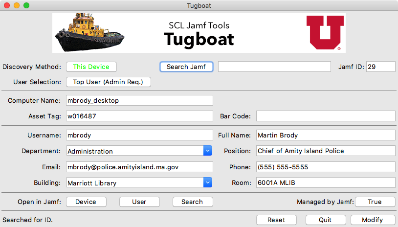

Tugboat is designed to make modifications to specific computer records on your Jamf Pro server. It can read from Jamf Pro directly with specific computer ID's or by selecting from search results.

This version is highly modified from our internal version. Please see the following discussion for advice on modifying Tugboat to best suit your needs.

*Note: Offering a tool designed from the outset to be customized at the source level is a new venture for us. If you feel the documentation we've included is not sufficient to help you successfully navigate the source code, please consider raising an issue and we'll do our best to correct any short comings.*

2/16/17: Unfortunately it seems a lot of people are running into the LDAP bug I reference in the [blog post](https://apple.lib.utah.edu/?p=2057). If you are attempting to login as an LDAP user, Jamf does not map it's LDAP group permissions correctly. This is a known issue referred to as Product Issue PI-003395 inside Jamf. I urge you to contact your Jamf Technical Representative(s) and elevate this issue with them.

4/11/17: Released version 1.5.2 of Tugboat. Lots of tweaks, added logging with management_tools, much improved login, searching and top user detection.

[Jamf's release notes](http://docs.jamf.com/9.98/casper-suite/release-notes/Bug_Fixes_and_Enhancements.html) for version 9.98 say that PI-003395 has been corrected. We're unable to test this and we're eager to hear from others if this is the case.

1/3/18: Released version 1.5.3 of Tugboat. Improved LDAP logins. Please be sure to enable LDAP Server 'READ' access.

1/15/18: Released version 1.5.4 of Tugboat. Host preference file and light code cleanup.

1/25/18: Released version 1.7 of Tugboat. Added logic to handle users with full editing privileges and read-only users. Additional logging added to support user levels and diagnose privilege issues. Included Windows executable again. The login functions in Tugboat and Cargo Ship are diverging, since Cargo Ship was always read-only by nature.

**1/29/18: Released version 1.7.1 of Tugboat. In audit (read-only) mode, the UI now correctly indicates that the information from the database cannot be changed. Corrected a login bug.**

## Contents

- [Contact](#contact)

- [System Requirements](#system-requirements)

- [Install](#install)

- [Uninstall](#uninstall)

- [Purpose](#purpose)

- [Usage](#usage)
  - [Launching](#launching)
  - [Main Window](#main-window)
  - [Navigation](#navigation)
  - [General](#general)
  - [User and Location](#user-and-location)
  - [Administration](#administration)

- [Jamf user privileges](#jamf-user-privileges)

- [Customizing Tugboat](#customizing-tugboat)

    - [ldap_object.py](#ldap-object.py)
    - [database_function.py](#database-funtion.py)

- [Notes](#notes)

- [Update History](#update-history)

## Contact

If you have any comments, questions, or other input, either [file an issue](../../issues) or [send us an email](mailto:mlib-its-mac-github@lists.utah.edu). Thanks!

## System Requirements

- Python 2.7+ (which you can download [here](https://www.python.org/download/))
- Pexpect 3.3+ (which you can download [here](https://github.com/pexpect/pexpect))
- Management tools (which you can download [here](https://github.com/univ-of-utah-marriott-library-apple/management_tools/releases))

If you intend to rebuild customized versions you will need the following tools, depending on your platform:

- py2app for MacOS applications (which you can download [here](https://pythonhosted.org/py2app/install.html))
- pyInstaller for Windows applications (which you can download [here](http://www.pyinstaller.org/))

## Install

Place the application in an appropriate location for your environment.

## Uninstall

Remove the application.

## Purpose

Tugboat began it's life as a technology demo, something that showed what we might be able to do with the Jamf API. It focused on filling in the fields of the **User and Location** pane of a Jamf computer record. It rapidly grew into an *micro-Jamf-remote-console*. It is primarily used as a client for our inventory efforts in the Marriott Library. The following screenshot shows it's current form:

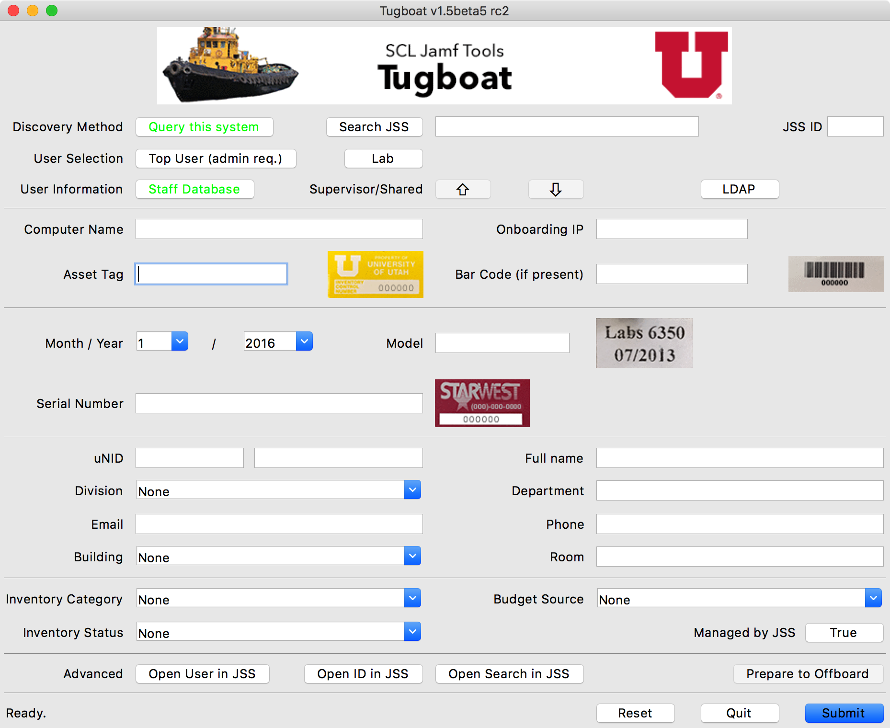

We use it to onboard (completing a machines inventory data) and offboard (removing machines from management quotas) computers and is cross-platform. The version included in this repository has had all of our site-specific code removed, since those segements would have little use to any other institution.

## Usage

Here's a quick demonstration of Tugboat in action:
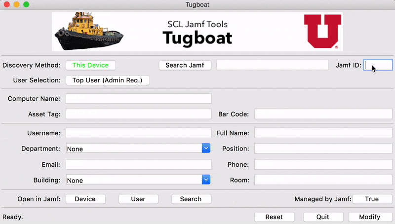

*Note: Tugboat does not* ***enroll*** *clients. To modify a computer record for a specific machine, it must already be present in the Jamf database.*

### Launching

On opening the application, provide your Jamf Pro server address, and a user with appropriate privileges.

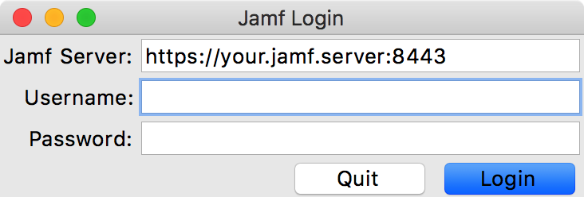

### Main Window

Here is the UI for the version of Tugboat included in this repository:

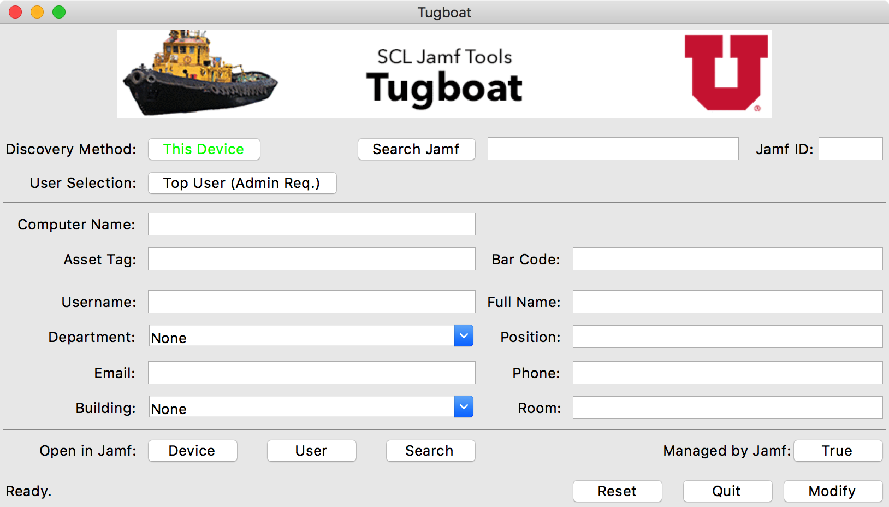

The interface can be broken down into 4 areas: **Navigation**, **General**, **User and Location**, and **Administration**. These areas mirror the panes of an individual computer record in the Jamf database.

### Navigation

The first line in the UI contains tools used to select the computer record and help select the user you would like to work on.

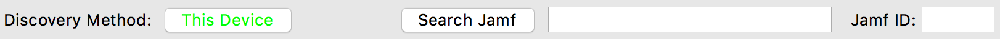

**This Device**: Open the record for the device the application is running on.

**Search Jamf**: Enter the information you'd like to search for in the text field and press the **Search Jamf** button. The following image shows the search results window.

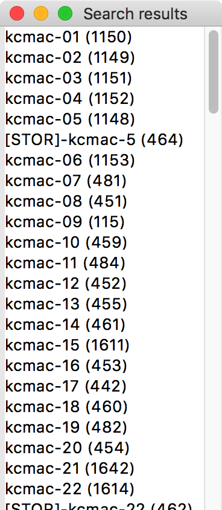

Select the machine you'd like to see and it's record will display.

**Jamf ID**: If you know the Jamf ID of the specific machine you'd like to see, enter it in the text field and press the Search Jamf button. *Note: The search string field must be empty to search for a specific ID.*

**Top User**: Attempts to find the user who is logged into the machine the most often. It requires an administrator password to function properly. The source is left as is, and can be modified to remove specific administrator accounts, etc as needed.

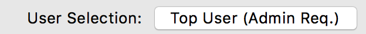

If the application is able to find a valid user, it will place the account name in the Username field and displays a message in the status field at the bottom of the window. For example, on my laptop I'm logged in 99% of the time.

If this method is not useful in your environment, you can remove it from the UI by editing the source code.

### General

This section shows fields located in the **General** pane of the computer record.

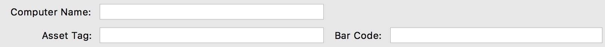

The **Computer Name** can be edited and appropriate **Asset Tag** and **Bar Code** information added, if your installation makes use of them. Note: there is a second Bar Code field available in Jamf and could be added here.

### User and Location

This section shows the fields included in the **User and Location** pane of the computer record. If your installation offers a staff database of some form, these fields could be automatically filled in.

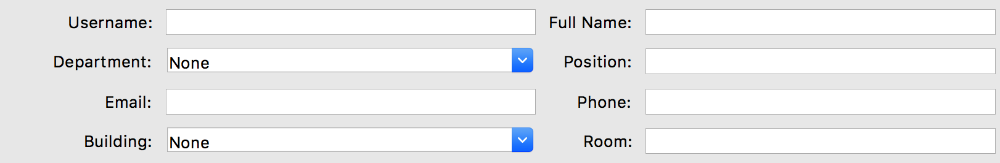

Most of these fields are self-explanatory. **Department** and **Building** are special cases. These fields are maintained in the Settings on Jamf: **Network Organization**, **Buildings** and **Departments**. You may not be making use of these fields and can be ignored. If you are using them, the application will fetch the choices and make them available.

### Administration

The last section offers advanced tools for interacting with the Jamf web interface and submitting changes back to the Jamf database.

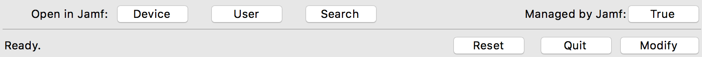

**Open in Jamf**: These buttons will open the current device, current user or current search in the Jamf web interface in your default browser.

**Managed by Jamf**: This button is an indicator showing wether the current machine is being managed by Jamf. It is only an indicator and isn't used to toggle this value in the computer record. However, this functionality can be enabled in the source code.

**Ready**: This is the status bar for the application. Important messages, errors and other notes will appear here to inform you about the success or failure of your activities.

**Reset**: Reset the state of the interface. If you've made a mistake editing a machine, press this button to erase the fields and begin again.

**Quit**: Exit the application.

**Modify**: Submit the current computer record to the Jamf database. A *201 Submitted* status message means the record was successfully accepted by the Jamf database.

Here are explanations of a couple potential error messages you might see:

**409 Resource conflict**: This message means that the record you attempted to submit contained identical information to another record existing in the Jamf database. This is a rare error and occurred most often in our environment when editing Windows machines that had identical UUIDs or MAC addresses.

**404 Resource not found**: This messages usually means the ID for the computer record you are editing was not found in the database. It's possible you may have accidentally changed it while editing other fields. Try reloading the record from the ID field or search results, make your changes and submit again. This message may occur during other activities, searching for example.

### Jamf user privileges

In order to use Jamf's API, your users will need the appropriate rights to certain areas of the database. To check these settings go to the following area: **All Settings**, **System Settings**, **JSS User Accounts & Groups**.

This chart shows the required privileges for Cargo Ship to operate properly:

| Field               | Create | Read | Update | Delete | Notes                                    |
| ------------------- | :----: | :--: | :----: | :----: | :--------------------------------------- |
| Accounts and Groups |        |  ☑   |        |        | Needed for login functionality           |
| Buildings           |        |  ☑   |        |        |                                          |
| Computers           |        |  ☑   |   ☑    |        | Without update right, user is considered read-only. |
| Departments         |        |  ☑   |        |        |                                          |
| LDAP Servers        |        |  ☑   |        |        | Needed for login functionality           |
| Users               |        |  ☑   |   ☑    |        | Without update right, user is considered read-only. |

These requirements are also included in the login method. If you make customizations, you may need to add these additional areas to the list of required privileges.

## Customizing Tugboat

The most obvious area for customization is utilizing an external source of information about your users. Relying on such a source can greatly reduce the possibility of typos and other mistakes when editing a computer record. In our environment we have a staff database for a majority of our users and campus LDAP server for the rest. I've included code snippets in the samples subdirectory that can help you integrate these services into your version of Tugboat.

### ldap_object.py

This is a python object that consumes an LDAP record from [dscl](https://developer.apple.com/legacy/library/documentation/Darwin/Reference/ManPages/man1/dscl.1.html) for a user and makes the data available to the developer by asking specific questions of it. "Is this person a student?", "What is this persons email address?", etc. Integrating this object with your code will require familiarity with the schema used by your particular institution.

The object as written requires underlying MacOS tools and does not rely on any additional Python modules. However, it may be helpful guiding you if you prefer to use another module for interacting with your particular LDAP or directory server.

### database_funtion.py

The other likely candidate for user information is a staff database of some kind. In our environment this is a mySQL database. The code I've included requires the MySQLdb module, you can find more information here: [MySQL-Python](http://mysql-python.sourceforge.net/).

Again, this code requires knowledge of the schema used by your database administrators and they should be brought into your project discussions early due the potentially sensitive nature of this type of information. Again, you will not be able to use this code as is, it will need to be heavily modified.

## Notes

Formerly known by a large number of names...

I like to think of Tugboat as the spiritual successor of my first Macintosh application, written a very long time ago. You can still download it [today](https://www.info-mac.org/viewtopic.php?f=108&t=1285), but you'd need a very old Mac to run it.

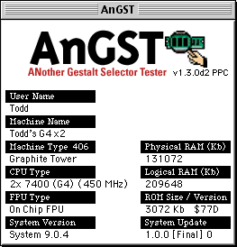

My heartfelt thanks to the other members of the Mac Group and the IT administration of the Marriott Library for their support, bug reports and feature requests!

## Update History

| Date       | Version | Notes                                    |
| ---------- | ------- | ---------------------------------------- |
| 2018.01.29 | 1.7.1   | Adjusted UI to reflect read-only nature of audit mode. Login bug corrected. |
| 2018.01.25 | 1.7.0   | Added full/read-only user support. Additional logging. |
| 2018.01.15 | 1.5.4   | Host preference file. Light code cleanup. |
| 2018.01.03 | 1.5.3   | Improved LDAP logins.                    |
| 2017.04.11 | 1.5.2   | Logging with management_tools, login and search much improved, top user improved. Other tweaks. |
| 2017.02.15 | 1.5.0   | Initial public release.                  |

